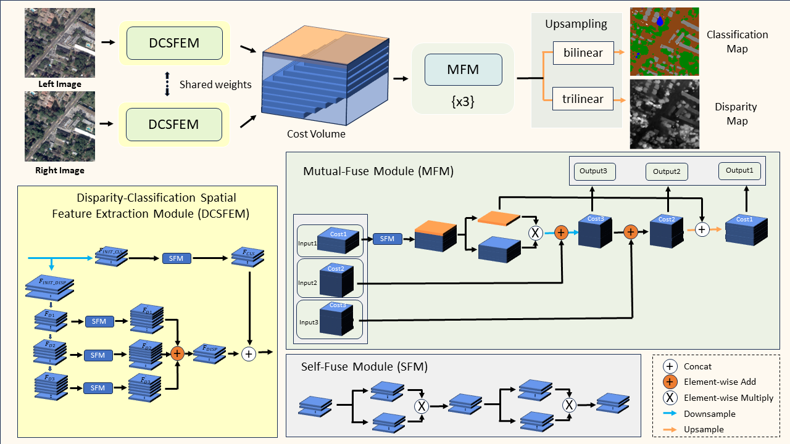
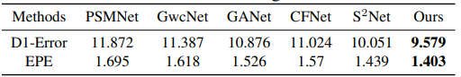
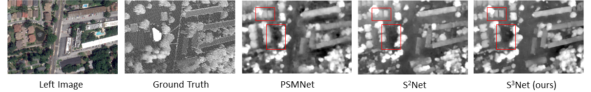
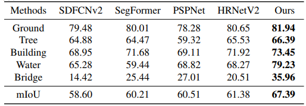
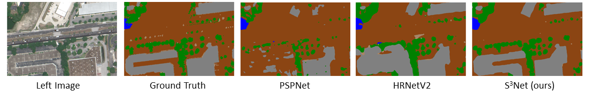

# S3Net

[English](./README.md) | 简体中文 

CVEO小组在IGARSS 2024学术研讨会上提交的论文"在卫星极线图像中使用创新的单分支语义立体网络(S3Net)进行立体匹配和语义分割"的开源代码


## S3Net网络流程
### 模型框架

### 结果
##### 在US3D测试集上的立体匹配结果





#### 在US3D测试集上的语义分割结果




## 使用方法
### 安装
```bash
git clone https://github.com/CVEO/S3Net.git
cd S3Net
conda env create -f environment.yml
conda activate s3net
```
### 数据集
我们实验中使用的数据集是US3D的[track-2](https://ieee-dataport.org/open-access/data-fusion-contest-2019-dfc2019)数据集

### 预训练权重
[Baidu Disk](https://pan.baidu.com/s/1EHYTq4eBKVJXgeFTq8SYFQ?pwd=1111) : 1111 

[Google Drive](https://drive.google.com/file/d/1QrbsIir5FmKkZ2xlNL57AQKeQ7-vMubh/view?usp=drive_link)
### 训练
#### 多卡
```
CUDA_VISIBLE_DEVICES=0,1,2,3 python -m torch.distributed.launch --nproc_per_node=4 multi_train.py --datapath work_directory --savepath checkpoints_directory
```
#### 单卡
```
python single_train.py --datapath work_directory --savepath checkpoints_directory
```
### 测试
```
python test.py --ckpt ./ckpt.tar --ImgL imgL.tif --ImgR imgR.tif
```
## 文件目录说明
```
S3Net 
├── example
│   ├── cls.png
│   ├── disp.png
│   └── model.png
├── data
│   ├── DFC2019Loader.py
│   └── data.py
├── model
│   └── model.py
├── README-zh_CN.md
├── README.md
├── environment.yml
├── evaluation.py
├── multi_test.py
├── test.py
├── multi_train.py
└── single_train.py
```

## 许可证
该代码仅用于非商业和研究目的。如需商业用途，请联系作者。


## 引用本文
如果你认为S3Net对你有帮助，请考虑给予一个星星⭐️并引用：
```
@article{yang2024s3net,
  title={S3Net: Innovating Stereo Matching and Semantic Segmentation with a Single-Branch Semantic Stereo Network in Satellite Epipolar Imagery},
  author={Yang, Qingyuan and Chen, Guanzhou and Tan, Xiaoliang and Wang, Tong and Wang, Jiaqi and Zhang, Xiaodong},
  journal={arXiv preprint arXiv:2401.01643},
  year={2024}
}
```