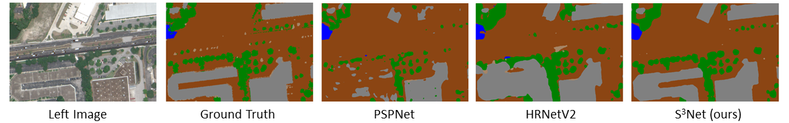

# S3Net


English | [简体中文](./README-zh_CN.md) 

Open-source codes of CVEO recent work "S3Net: Innovating Stereo Matching and Semantic Segmentation with a Single-Branch Semantic Stereo Network in Satellite Binocular Imagery" on IGARSS 2024 Symposium.

## Processd S3Net
### Model framework

### Results
##### Results of Stereo Matching on the US3D Test Set


#### Results of Semantic Segmentation on the US3D Test Set



## Usage
### Installation
```bash
git clone https://github.com/CVEO/S3Net.git
cd S3Net
conda env create -f environment.yml
conda activate s3net
```
### Datasets
The dataset used in our experiment is the track-2 dataset of US3D in [2019 Data Fusion Contest](https://ieee-dataport.org/open-access/data-fusion-contest-2019-dfc2019)
### Pretrained Weights
[Baidu Disk](https://pan.baidu.com/s/1EHYTq4eBKVJXgeFTq8SYFQ?pwd=1111) : 1111 

[Google Drive](https://drive.google.com/file/d/1QrbsIir5FmKkZ2xlNL57AQKeQ7-vMubh/view?usp=drive_link)
### Training
#### multi-gpu
```
CUDA_VISIBLE_DEVICES=0,1,2,3 python -m torch.distributed.launch --nproc_per_node=4 multi_train.py --datapath work_directory --savepath checkpoints_directory
```
#### single-gpu
```
python single_train.py --datapath work_directory --savepath checkpoints_directory
```
### Testing
```
python test.py --ckpt ./ckpt.tar --ImgL imgL.tif --ImgR imgR.tif
```
## File Directory Description
```
S3Net 
├── example
│   ├── cls.png
│   ├── disp.png
│   ├── model.png
│   ├── table_cls.png
│   └── table_disp.png
├── data
│   ├── DFC2019Loader.py
│   └── data.py
├── model
│   └── model.py
├── README-zh_CN.md
├── README.md
├── environment.yml
├── evaluation.py
├── multi_test.py
├── test.py
├── multi_train.py
└── single_train.py
```

## License
Code is released for non-commercial and research purposes only. For commercial purposes, please contact the authors.


## Cite this work
If you find S3Net useful in your research, please consider giving a star ⭐ and citing:
```
@article{yang2024s3net,
    title={S3Net: Innovating Stereo Matching and Semantic Segmentation with a Single-Branch Semantic Stereo Network in Satellite Epipolar Imagery},
    author={Yang, Qingyuan and Chen, Guanzhou and Tan, Xiaoliang and Wang, Tong and Wang, Jiaqi and Zhang, Xiaodong},
    journal={arXiv preprint arXiv:2401.01643},
    year={2024}
}
```

or cite the old version S2Net:

```
@ARTICLE{liao2024s2net,
    author={Liao, Puyun and Zhang, Xiaodong and Chen, Guanzhou and Wang, Tong and Li, Xianwei and Yang, Haobo and Zhou, Wenlin and He, Chanjuan and Wang, Qing},
    journal={IEEE Transactions on Geoscience and Remote Sensing}, 
    title={S2Net: A Multitask Learning Network for Semantic Stereo of Satellite Image Pairs}, 
    year={2024},
    volume={62},
    number={},
    pages={1-13},
    doi={10.1109/TGRS.2023.3335997}}
```
