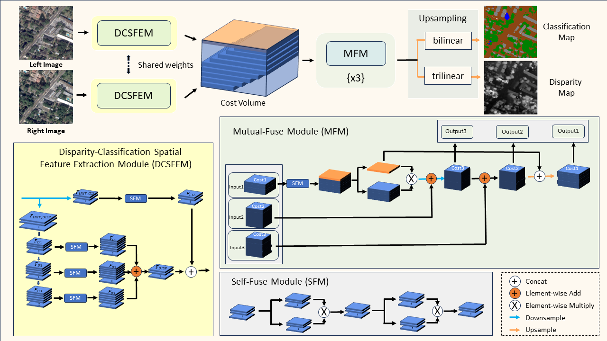
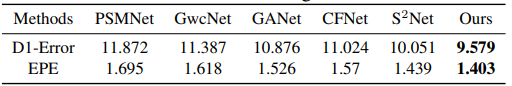

# S3Net

English | [简体中文](./README-zh_CN.md) 

Open-source codes of CVEO recent work "S3Net: Innovating Stereo Matching and Semantic Segmentation with a Single-Branch Semantic Stereo Network in Satellite Binocular Imagery" on IGARSS 2024 Symposium.

## Model Overview
### Framework


### Results
#### Results of Stereo Matching on the US3D Test Set



#### Results of Semantic Segmentation on the US3D Test Set


## Usage
### Installation
```bash
git clone https://github.com/CVEO/S3Net.git
cd S3Net
conda env create -f environment.yml
conda activate s3net
```
### Datasets
The dataset used in our experiment is the track-2 dataset of US3D in [2019 Data Fusion Contest](https://ieee-dataport.org/open-access/data-fusion-contest-2019-dfc2019)
### Pretrained Weights
[Baidu Disk](https://pan.baidu.com/s/1EHYTq4eBKVJXgeFTq8SYFQ?pwd=1111) : 1111 

[Google Drive](https://drive.google.com/file/d/1QrbsIir5FmKkZ2xlNL57AQKeQ7-vMubh/view?usp=drive_link)

## Training Launch Methods

### 1. Single-Node Single-GPU Training
```bash
python main.py
```

### 2. Single-Node Multi-GPU Training
```bash
torchrun --nproc_per_node=N main.py
```


### 3. Multi-Node Multi-GPU Training


#### Launch Commands
On the master node:
```bash
torchrun --nproc_per_node=4 --nnodes=N --node_rank=0 --master_addr=MASTER_IP --master_port=PORT main.py
```

On other nodes:
```bash
torchrun --nproc_per_node=4 --nnodes=N --node_rank=R --master_addr=MASTER_IP --master_port=PORT main.py
```

## Inference Launch Methods

Use evaluation.py for model inference:
```bash
python test.py
```
## File Directory Description
```
S3Net 
├── example
│   ├── cls.png
│   ├── disp.png
│   ├── model.png
│   ├── table_cls.png
│   └── table_disp.png
├── models
│   └── model.py
├── README-zh_CN.md
├── README.md
├── environment.yml
├── utils.py
├── train.py
├── test.py
├── main.py
└── data.py
```

## Latest Work
If you are interested in our latest work, please check out our new project [TriGeoNet](https://github.com/CVEO/TriGeoNet)!

## License
Code is released for non-commercial and research purposes only. For commercial purposes, please contact the authors.


## Cite this work
If you find S3Net useful in your research, please consider giving a star ⭐ and citing:
```
@inproceedings{yang2024s,
  title={S3Net: Innovating Stereo Matching and Semantic Segmentation with a Single-Branch Semantic Stereo Network in Satellite Epipolar Imagery},
  author={Yang, Qingyuan and Chen, Guanzhou and Tan, Xiaoliang and Wang, Tong and Wang, Jiaqi and Zhang, Xiaodong},
  booktitle={IGARSS 2024-2024 IEEE International Geoscience and Remote Sensing Symposium},
  pages={8737--8740},
  year={2024},
  organization={IEEE}
}
```

or cite the old version S2Net:

```
@article{liao2023s,
  title={S2Net: A Multitask Learning Network for Semantic Stereo of Satellite Image Pairs},
  author={Liao, Puyun and Zhang, Xiaodong and Chen, Guanzhou and Wang, Tong and Li, Xianwei and Yang, Haobo and Zhou, Wenlin and He, Chanjuan and Wang, Qing},
  journal={IEEE Transactions on Geoscience and Remote Sensing},
  volume={62},
  pages={1--13},
  year={2023},
  publisher={IEEE}
}
```
